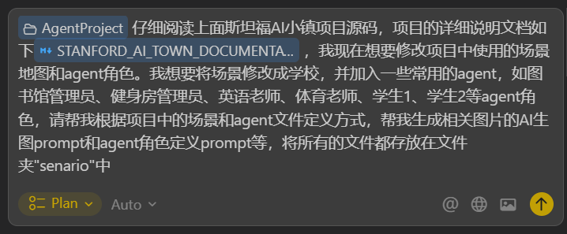
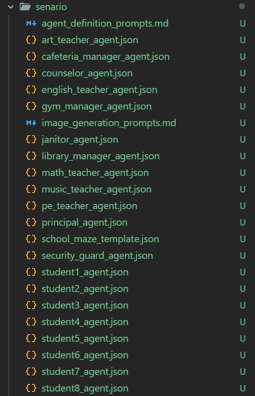
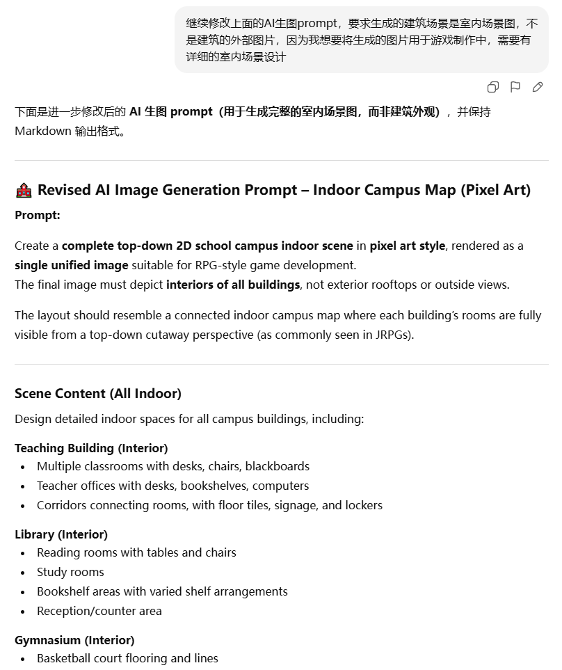
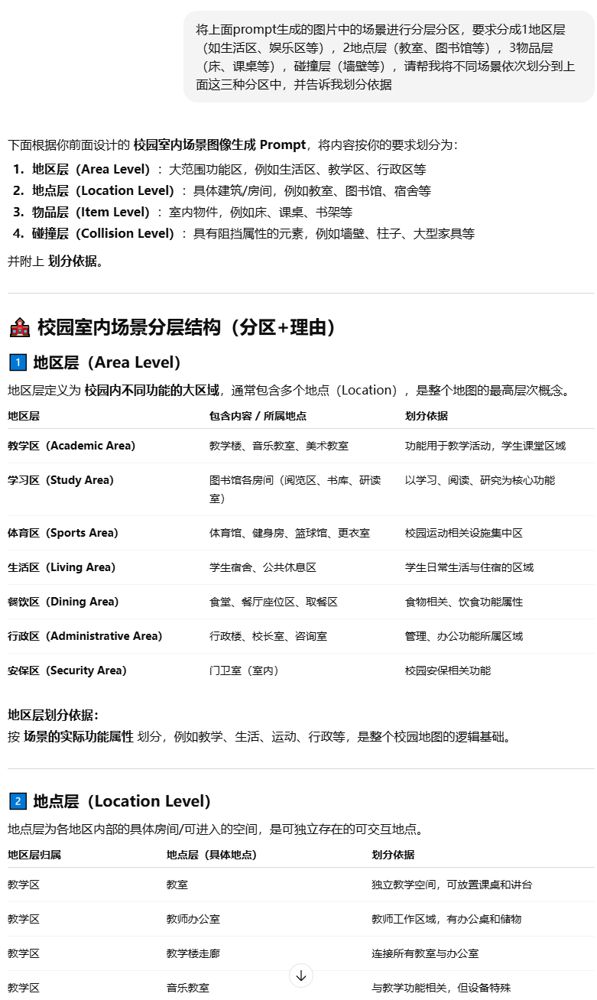
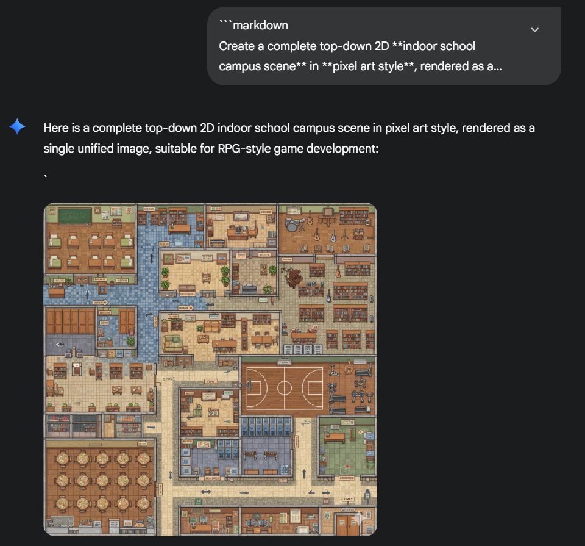
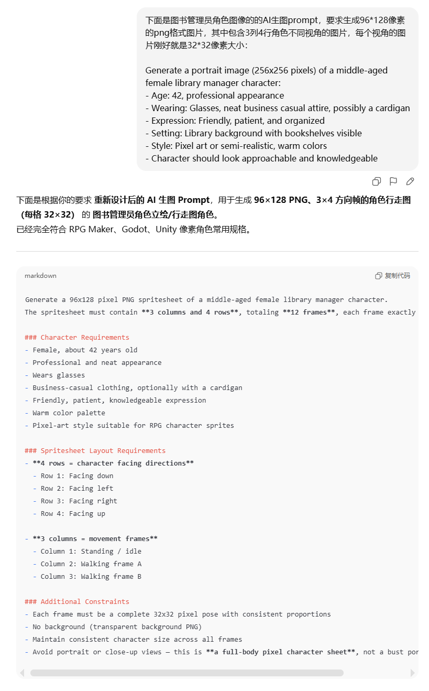
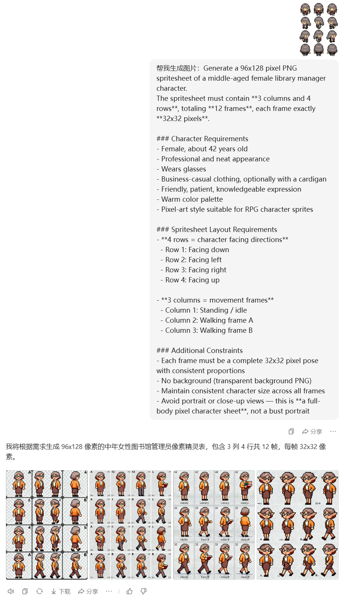
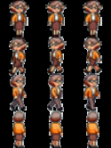

# AIGC使用教程

## 生成场景图AI生图Prompt

> 推荐使用**AI IDE**直接生成所有需要的内容
>
> 操作演示如下（以Cursor的Plan模式为例）：
>
> 
>
> 生成的Plan文件如下：
>
> ```markdown
> # 学校场景和Agent角色生成计划
> 
> ## 目标
> 
> 将项目场景从"小镇"改为"学校"，并创建20个新的agent角色定义文件、AI生图prompt和角色定义prompt。
> 
> ## 文件结构
> 
> 在`AgentProject/senario/`文件夹中创建以下文件：
> 
> ### 1. 地图配置文件
> 
> - `school_maze_template.json` - 学校场景地图模板（基于village/maze.json结构）
> - 世界名称：从"the Ville"改为"学校"
> - 包含学校典型区域：教学楼、图书馆、体育馆、食堂、宿舍、操场等
> - 定义四层地址系统：学校:区域:场所:对象
> 
> ### 2. Agent角色配置文件（20个）
> 
> #### 教职员工类（8个）
> 
> - `library_manager_agent.json` - 图书馆管理员
> - `gym_manager_agent.json` - 健身房管理员
> - `english_teacher_agent.json` - 英语老师
> - `pe_teacher_agent.json` - 体育老师
> - `math_teacher_agent.json` - 数学老师
> - `principal_agent.json` - 校长
> - `cafeteria_manager_agent.json` - 食堂管理员
> - `security_guard_agent.json` - 保安
> 
> #### 学生类（8个）
> 
> - `student1_agent.json` - 学生1（班长）
> - `student2_agent.json` - 学生2（学习委员）
> - `student3_agent.json` - 学生3（体育委员）
> - `student4_agent.json` - 学生4（文艺委员）
> - `student5_agent.json` - 学生5（普通学生）
> - `student6_agent.json` - 学生6（普通学生）
> - `student7_agent.json` - 学生7（普通学生）
> - `student8_agent.json` - 学生8（普通学生）
> 
> #### 其他工作人员类（4个）
> 
> - `janitor_agent.json` - 清洁工
> - `music_teacher_agent.json` - 音乐老师
> - `art_teacher_agent.json` - 美术老师
> - `counselor_agent.json` - 心理辅导员
> 
> 每个agent.json包含：
> 
> - name, portrait路径, coord初始坐标
> - currently当前状态描述
> - scratch（age, innate, learned, lifestyle, daily_plan）
> - spatial（address和tree空间记忆树）
> 
> ### 3. AI生图Prompt文件
> 
> - `image_generation_prompts.md` - 包含所有图片生成的prompt
> - 学校场景地图tilemap生成prompt
> - 20个agent的portrait.png生成prompt（头像，每个角色独特的形象）
> - 20个agent的texture.png生成prompt（精灵图，32x32像素，包含上下左右四个方向的行走动画）
> 
> ### 4. Agent角色定义Prompt文件
> 
> - `agent_definition_prompts.md` - 包含用于生成agent.json详细内容的prompt模板
> - 20个角色的详细背景、性格、日程安排等prompt
> - 每个角色的空间记忆树结构（spatial.tree）
> - 角色之间的潜在关系和互动场景
> - 用于指导LLM生成完整的agent配置
> 
> ## 实现细节
> 
> ### 地图结构设计
> 
> 学校场景包含以下区域：
> 
> - 教学楼（教室、办公室、走廊）
> - 图书馆（阅览室、自习室、书架区）
> - 体育馆（健身房、篮球场、更衣室）
> - 食堂（用餐区、打饭窗口）
> - 学生宿舍（房间、公共区域）
> - 操场（运动场、跑道）
> 
> ### Agent角色设计（20个角色）
> 
> #### 教职员工类（8个）
> 
> 1. **图书馆管理员** - 负责图书管理、借还书、维护阅览秩序
> 2. **健身房管理员** - 管理体育设施、维护器材、组织体育活动
> 3. **英语老师** - 教授英语课程、批改作业、组织英语活动
> 4. **体育老师** - 教授体育课、组织运动会、管理运动队
> 5. **数学老师** - 教授数学课程、辅导学生、组织数学竞赛
> 6. **校长** - 学校管理者、处理行政事务、参加会议
> 7. **食堂管理员** - 管理食堂运营、监督食品安全、协调用餐时间
> 8. **保安** - 维护校园安全、巡逻、管理进出人员
> 
> #### 学生类（8个）
> 
> 9. **学生1（班长）** - 负责班级管理、传达通知、组织班级活动
> 10. **学生2（学习委员）** - 负责学习事务、收发作业、组织学习小组
> 11. **学生3（体育委员）** - 负责体育活动、组织训练、参加比赛
> 12. **学生4（文艺委员）** - 负责文艺活动、组织演出、参加艺术社团
> 13. **学生5（普通学生）** - 认真学习、参加社团、与同学互动
> 14. **学生6（普通学生）** - 认真学习、参加社团、与同学互动
> 15. **学生7（普通学生）** - 认真学习、参加社团、与同学互动
> 16. **学生8（普通学生）** - 认真学习、参加社团、与同学互动
> 
> #### 其他工作人员类（4个）
> 
> 17. **清洁工** - 负责校园清洁、维护环境卫生、清理垃圾
> 18. **音乐老师** - 教授音乐课程、组织合唱团、指导乐器学习
> 19. **美术老师** - 教授美术课程、组织画展、指导艺术创作
> 20. **心理辅导员** - 提供心理咨询、组织心理健康活动、处理学生问题
> 
> 每个角色需要：
> 
> - 符合学校场景的职业/身份
> - 独特的性格特征和日常作息
> - 与学校场景相关的空间记忆树
> - 合理的初始坐标位置
> - 角色之间的潜在互动关系
> 
> ## 参考文件
> 
> - `AgentProject/generative_agents/frontend/static/assets/village/maze.json` - 地图结构参考
> - `AgentProject/generative_agents/frontend/static/assets/village/agents/伊莎贝拉/agent.json` - Agent配置参考
> - `AgentProject/generative_agents/frontend/static/assets/village/agents/sprite.json` - 精灵图配置参考
> ```
>
> 让AI将所需的文件统一生成到一个文件夹中，效果如下：
>
> > AI生图Prompt以`Markdown`格式输出到`.md`文件中，角色定义Prompt文件直接生成到`.json`文件 中
>
> 

## 基于场景图生成场景描述

直接使用上面AI生成的AI生图Prompt让AI生图工具生成场景图可能效果并不好，如下：

> 我们想要的场景图应该是建筑内部的构造图，这些可以加入到提示词里面，让AI优化提示词




让AI根据上面生成的Prompt生成详细的场景图层分区（后面需要使用Tiled软件来手动标注场景图中的不同功能分区）：



使用修改后的AI生图Prompt生成场景图，效果如下：



## 生成角色Agent素材图AI生图Prompt

使用AI优化生成的AI生图Prompt（要求生成4行3列，128*96像素的png格式图片）：



使用豆包，给参考图并使用生成的Prompt生成所需的Agent素材图：



然后使用PS将图片中的人物抠出，并resize到**32**尺寸大小，并拼接生成128*96尺寸大小的拼接图，实际效果图如下：



> 思考：能否创建一个更简单且重复可用的工作流？