# Tiled软件教程文档

## 软件下载

软件链接：[http://www.mapeditor.org/](http://www.mapeditor.org/)

## 创建项目和地图

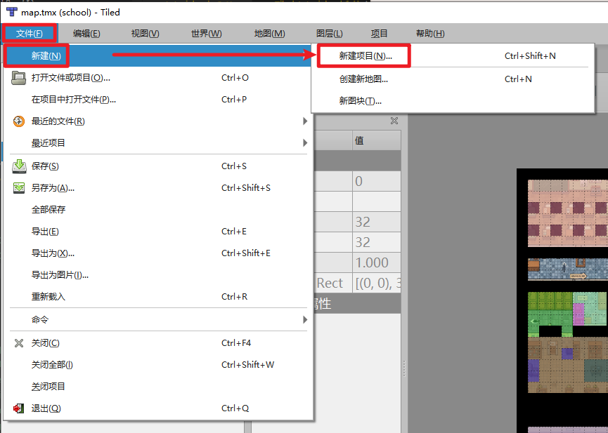

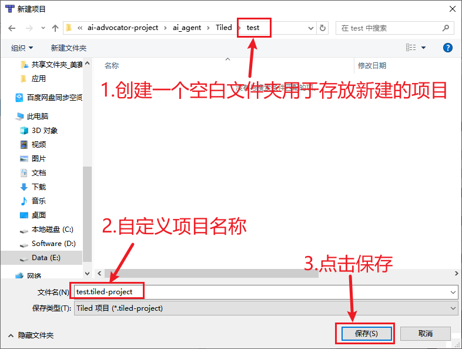

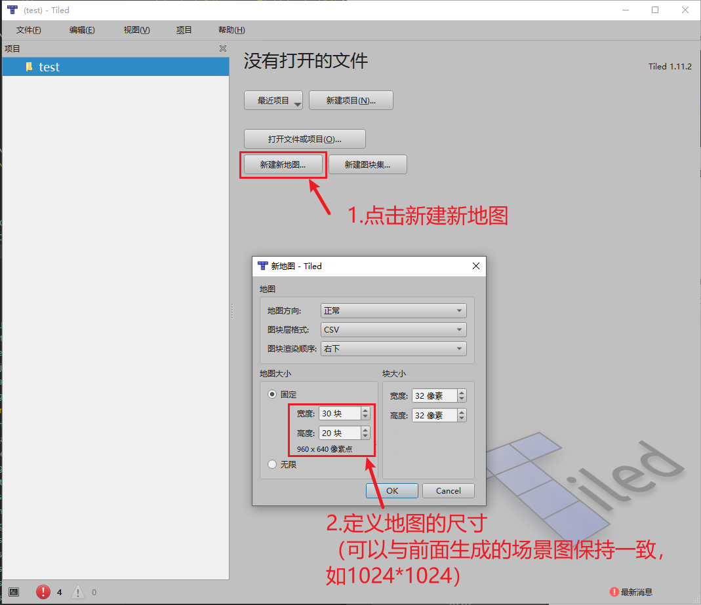

创建的空白地图如下：

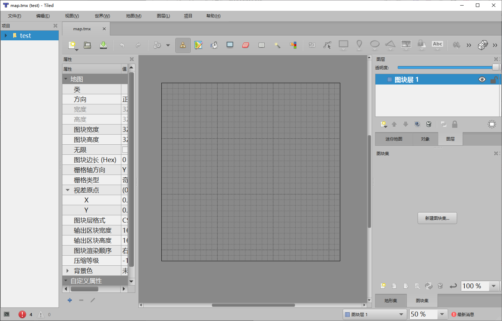

## 创建图层

在右侧“图层”面板中，用户可以创建新的“图块层”（即对应游戏场景中的不同图层）、“图像层”（即可以直接导入外部图片素材）：

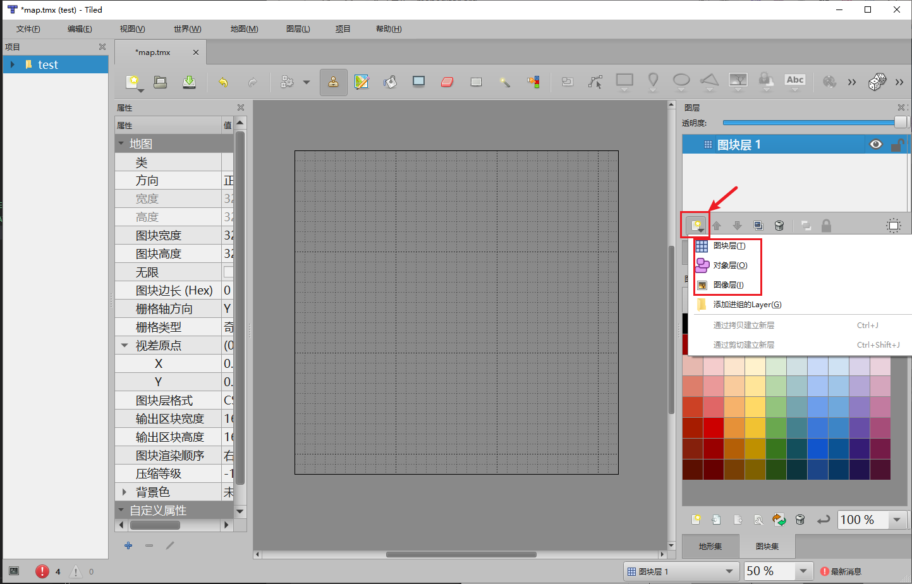

> *请提前将所有的图片素材放置到项目文件夹中，如下图所示：*
>
> 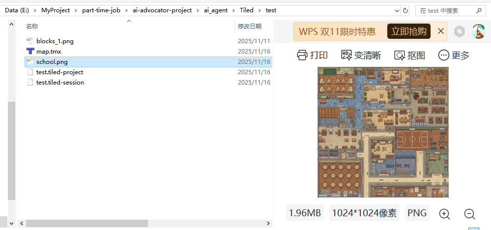

添加“图像层”，使用准备好的场景图片：

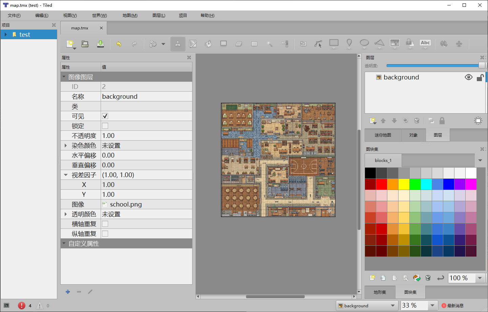

添加“图块集”（可以添加一些素材图片用来绘制场景图，或者添加颜色图块素材，用来进行不同图层标注）：

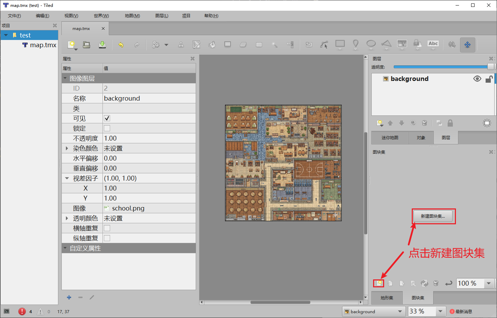

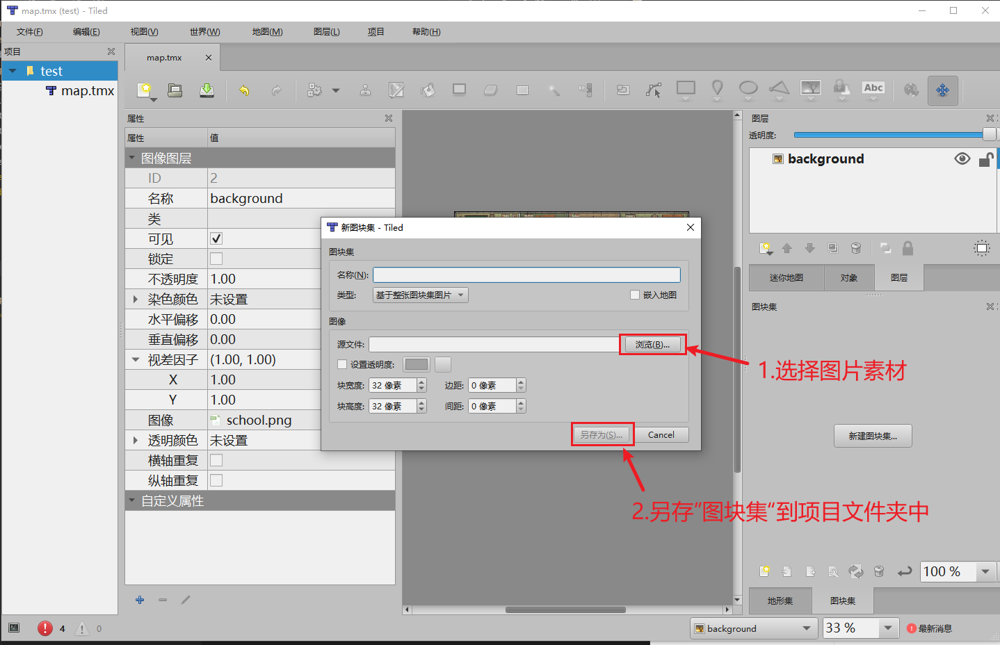

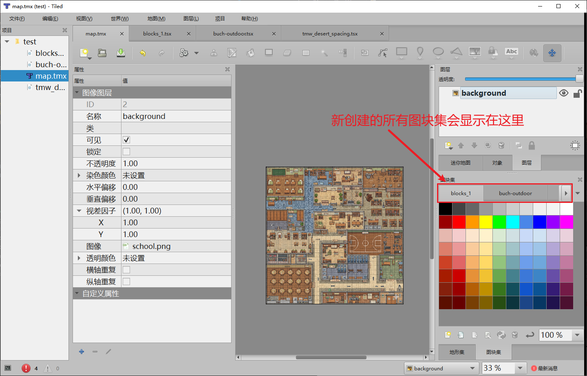

可以使用不同的颜色色块来标注不同的图层区域，从而实现场景划分，最后效果如下图所示：

## 图层绘制

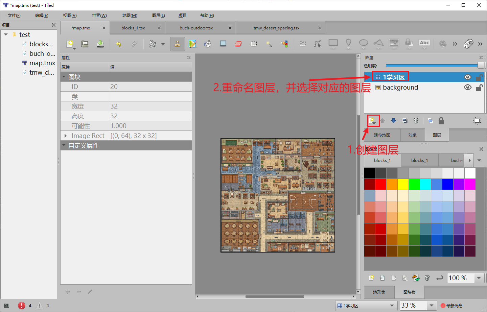

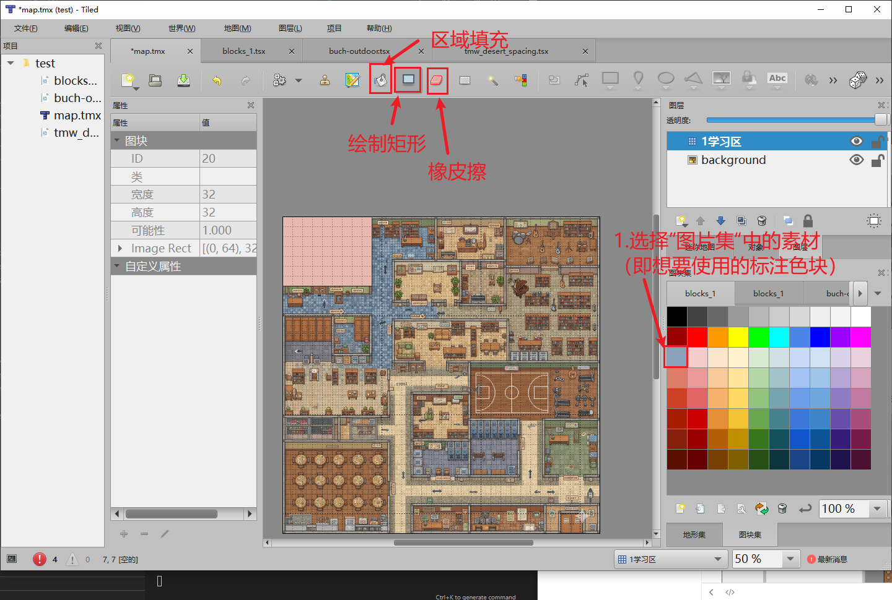

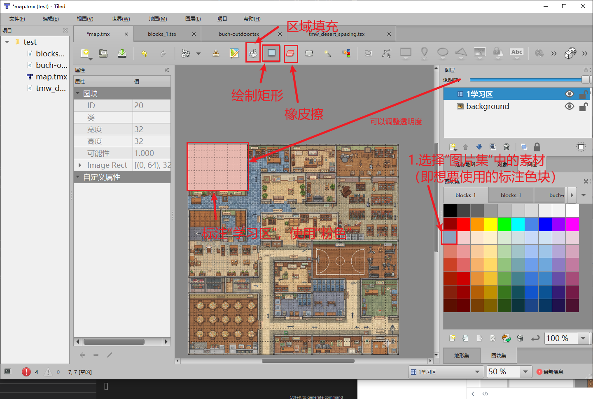
