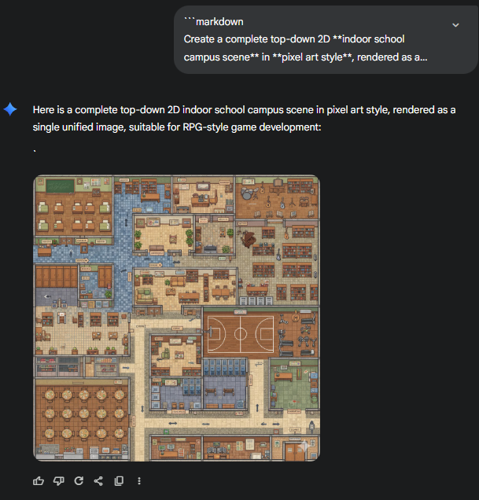
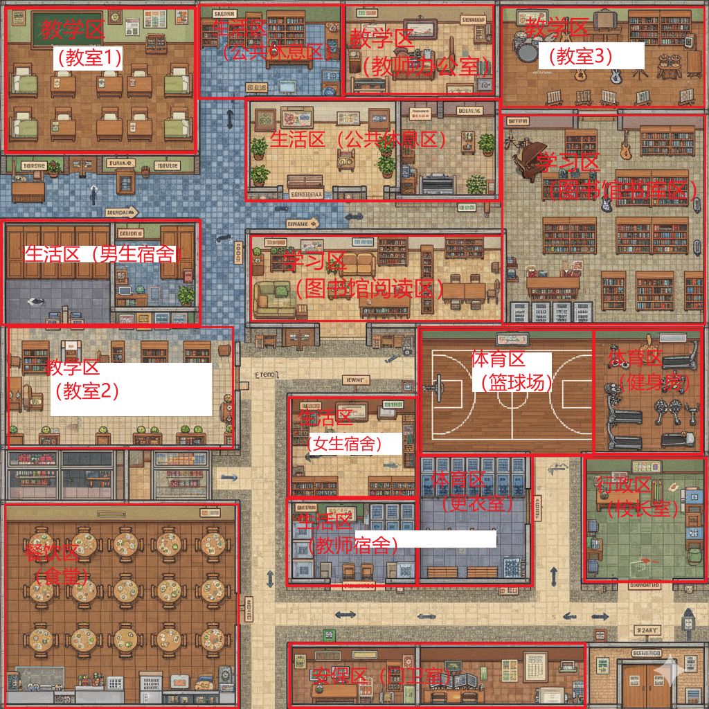
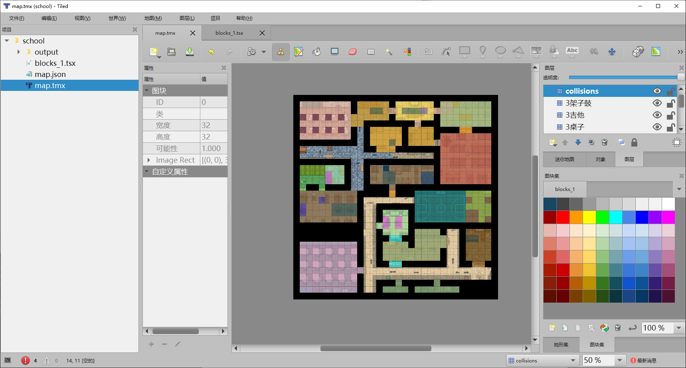

# AI小镇DIY教程

## DIY地图Map

> 推荐使用AI生成所需的场景图的AI生图prompt，然后利用生图工具生成场景地图（详细教程见：[AIGC_tutorial.md](./AIGC_tutorial.md)）

如下面为AI生成的**学校**的场景图AI生图Prompt（要求：2D图、由32*32的方格组成的像素风格图、建筑物为可见内部构造结构轮廓）：

```
Create a **complete top-down 2D school campus scene** in **pixel art style**, rendered as a **single cohesive image** rather than separate scenes.
The style should follow **RPG pixel-art aesthetics** with a **32×32 tile-like look**, but the output is a **finished image**, not tiled JSON.

### **Scene Content**

The image should depict a full school campus from a top-down perspective, including:

#### **Buildings (with visible roofs and structural outlines)**

* A large **teaching building** with clear block segmentation suggesting classrooms, offices, and corridors
* A **library** with identifiable reading-room and study-room window patterns
* A **gymnasium** indicating areas for basketball and fitness rooms
* A **cafeteria** with dining-hall style exterior
* A **student dormitory** with repeated window layout
* An **administrative building** with principal/counseling office hints
* A **music classroom** and **art classroom** (small buildings or attached rooms)
* A **school gate** with a **security guard room**

### **Outdoor Areas**

* A **sports field** including a running track and football field
* **Continuous campus pathways** that naturally connect all major buildings
* **Detailed road elements**, such as:

  * Crosswalks
  * Curbs
  * Asphalt texture
  * Drainage grates
  * Road markings
  * Smooth intersections
* **Green spaces**, trees, bushes, benches, fountains, or campus decorations

### **Style Requirements**

* **Pixel art style**, 2D top-down
* Colors: **Warm, educational palette** (browns, beiges, greens, blues)
* Indoor vs outdoor areas implied through building roofs, shading, and layout
* Rich environmental details, avoiding empty or repetitive spaces
* No splitting the image: **produce one large, unified campus scene**

### **Output Requirements**

* **Generate a complete scene image**, jpeg format
* The scene should feel natural and connected, **not like multiple images stitched together**
* Ensure all pathways and roads logically link buildings and outdoor areas
```

使用Nano Banana（Gemini）工具生图，效果如下图所示：



对图中不同区域进行标注和划分，划分后的效果如下：



使用Tiled软件进行详细标注：

> Tiled软件的教程详见文档：[Tiled_tutorial.md](./Tiled_tutorial.md)



标注完成后需要导出地图，详细操作参考项目[tiled_to_maze.json](https://github.com/jiejieje/tiled_to_maze.json)中的[使用教程.pdf](https://github.com/jiejieje/tiled_to_maze.json/blob/main/%E4%BD%BF%E7%94%A8%E6%95%99%E7%A8%8B.pdf)

## DIY角色Agent

> 推荐使用AI生成所需的角色人物定义prompt以及各视角图片（详细教程见：[AIGC_tutorial.md](./AIGC_tutorial.md)）

### AI生成角色定义 `agent.json`配置文件

下面为AI生成的**图书管理员**Agent的角色定义Prompt（*Json格式*）（要求：2D图、由32*32的方格组成的像素风格图、建筑物为可见内部构造结构轮廓）：

```json
{
  "name": "图书馆管理员",
  "portrait": "assets/school/agents/图书馆管理员/portrait.png",
  "coord": [70, 20],  //角色初始位置（一般在宿舍）
  "currently": "图书馆管理员正在图书馆借还书处整理图书，准备处理学生的借还书请求。她正在检查图书归还情况，并准备更新图书管理系统。",
  "scratch": {
    "age": 42,
    "innate": "细心、耐心、有条理、热爱阅读",  //人物性格
    "learned": "图书馆管理员负责管理学校图书馆的日常运营，包括图书借还、分类整理、维护阅览秩序。她熟悉图书馆的每一本书，总是能帮助学生找到需要的资料。",  //人物工作内容
    "lifestyle": "图书馆管理员早上7点起床，8点到达图书馆开始工作，晚上6点下班。她喜欢在午休时间阅读，晚上10点睡觉。",  //生活方式
    "daily_plan": "图书馆管理员每天早上8点开放图书馆，在借还书处服务学生，整理图书分类，维护阅览室秩序，下午5点关闭图书馆前进行最后的整理工作。"  //每日工作计划
  },
  "spatial": {
    "address": {
      "living_area": [  //living_area 需要根据自己标注的maze.json进行修改！！！
        "学校",
        "教职工宿舍",
        "图书馆管理员的房间"
      ]
    },
    "tree": {  //tree 需要根据自己标注的maze.json进行修改！！！
      "学校": {
        "图书馆": {
          "借还书处": [
            "服务台",
            "借还书系统",
            "图书扫描仪"
          ],
          "阅览室": [
            "阅览桌",
            "书架",
            "阅读灯"
          ],
          "自习室": [
            "自习桌",
            "椅子",
            "插座"
          ],
          "书架区": [
            "书架",
            "分类标签",
            "检索系统"
          ]
        },
        "教学楼": {
          "走廊": []
        },
        "食堂": {
          "用餐区": [
            "餐桌",
            "椅子"
          ]
        }
      }
    }
  }
}
```

下面是使用AI根据我标注生成的 `maze.json`文件内容进行修改后的 `agent.json`角色定义配置文件：

```json
{
  "name": "图书馆管理员",
  "portrait": "assets/school/agents/图书馆管理员/portrait.png",
  "coord": [23, 6],
  "currently": "图书馆管理员正在图书馆借还书处整理图书，准备处理学生的借还书请求。她正在检查图书归还情况，并准备更新图书管理系统。",
  "scratch": {
    "age": 42,
    "innate": "细心、耐心、有条理、热爱阅读",
    "learned": "图书馆管理员负责管理学校图书馆的日常运营，包括图书借还、分类整理、维护阅览秩序。她熟悉图书馆的每一本书，总是能帮助学生找到需要的资料。",
    "lifestyle": "图书馆管理员早上7点起床，8点到达图书馆开始工作，晚上6点下班。她喜欢在午休时间阅读，晚上10点睡觉。",
    "daily_plan": "图书馆管理员每天早上8点开放图书馆，在借还书处服务学生，整理图书分类，维护阅览室秩序，下午5点关闭图书馆前进行最后的整理工作。"
  },
  "spatial": {
    "address": {
      "living_area": [
        "the Ville",
        "学习区",
        "图书馆藏书室",
        "桌子"
      ]
    },
    "tree": {
      "the Ville": {
        "学习区": {
          "图书馆阅读室": [
            "桌子",
            "椅子",
            "图书架"
          ],
          "图书馆藏书室": [
            "图书架",
            "桌子"
          ]
        },
        "餐饮区": {
          "食堂": [
            "餐桌",
            "椅子"
          ]
        },
        "教学区": {
          "教师办公室": [
            "桌子",
            "椅子"
          ]
        }
      }
    }
  }
}
```

### AI生成角色素材图的AI生图Prompt

详见文档：[AIGC_tutorial.md](./AIGC_tutorial.md)

## 修改项目代码

准备好所有的场景素材和Agent素材之后，按照如下格式存放到文件夹 `generative_agents/frontend/static/assets/school/`：

```
|- school
    |- agents
    |   |- 图书管理员
    |   |   |- portrait.png  # 角色正面图
    |   |   |- texture.png   # 角色12个方向图
    |   |   |- agent.json    # 角色定义文件
    |   |- 校长
    |   |- 老师
    |   |- ....
    |- maze.json             # 地图文件（从Tiled中标注并导出）
```
